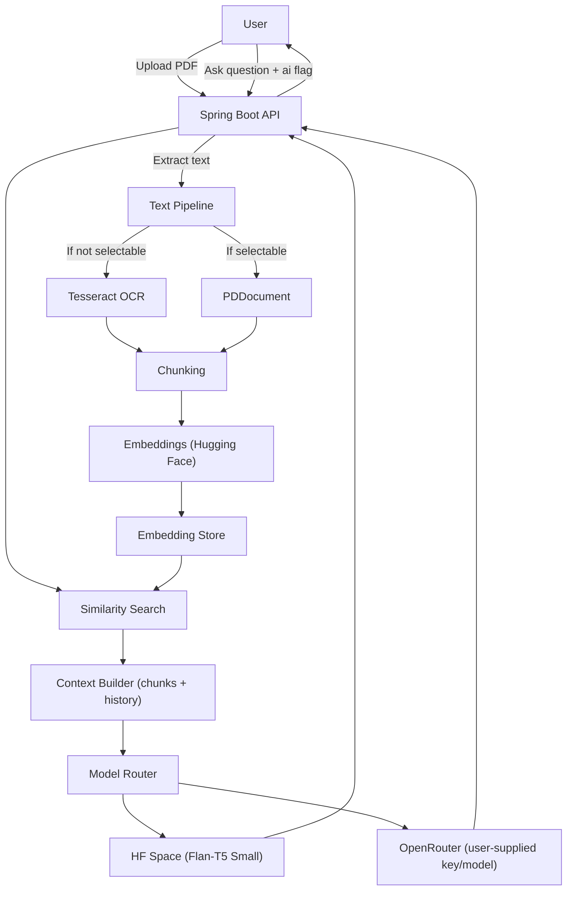

# PDF Chat Bot (Spring)

Talk to your PDFs. Upload a PDF, we extract text (with OCR fallback), chunk it, embed the chunks, and answer user questions by routing to your selected AI model with the most similar chunks and full conversation history.

---

## Features

- Conversational Q&A over uploaded PDFs
- Automatic text extraction; falls back to OCR (Tesseract) for non-selectable/scanned PDFs
- Chunking and vector embeddings for semantic search
- Retrieval-Augmented Generation (RAG): relevant chunks + chat history are sent to the model
- Pluggable AI backends via a simple "ai flag"
  - Hugging Face Space (e.g., Flan-T5 Small) for answers
  - OpenRouter support: user can add their API key and preferred model name
- Embeddings can be generated via Hugging Face and stored remotely or locally
- Built with Spring Boot; optional GUI under `Pdf_Chat_Gui/`

---

## How it Works

1. User uploads a PDF.
2. The server extracts text. If the PDF is non-selectable, Tesseract OCR is used to extract text.
3. The text is split into chunks.
4. We generate embeddings for each chunk (via Hugging Face), and store the embeddings.
5. On each question, we:
   - Compute similarity between the question and stored embeddings
   - Select the top similar chunks
   - Combine the question, similar chunks, and conversation history
   - Route to the selected AI backend based on the user-provided flag
6. The model returns an answer grounded in the retrieved chunks.

---

## 🎥 Demo Video
[Watch the demo video here](https://drive.google.com/file/d/1ATC6DJtEzKhxv7H_AYCL2d70Na9_Ip0x/view?usp=drive_link)

---

## Architecture (High-level)



---

## Tech Stack

- Spring Boot (Java)
- Hugging Face (Spaces/Inference for embeddings and hosted model)
- Flan-T5 Small (deployed in a separate Space)
- OpenRouter (optional; user-provided API key and model name)
- Tesseract OCR (for scanned PDFs)
- Maven build (`mvnw`, `mvnw.cmd` included)
- React 19 + Vite (frontend)
- Redux Toolkit + Redux Persist
- React Router 7
- Tailwind CSS
- Axios
- react-markdown

---

## Frontend (React)

Location: `Pdf_Chat_Gui/`

- Built with Vite + React 19
- State: Redux Toolkit + Redux Persist
- Routing: React Router 7
- Styling: Tailwind CSS (via `@tailwindcss/vite`), plus `App.css`
- HTTP: Axios thunks
- Markdown rendering: `react-markdown`

Scripts:

```bash
cd Pdf_Chat_Gui
npm install
npm run dev      # start Vite dev server
npm run build    # production build
npm run preview  # preview production build
```

API base URLs (adjust for your backend host/port):

- `src/axios/chatRequest.js` → `http://localhost:8081/api/chat`
- `src/axios/pdfRequeste.js` → `http://localhost:8081/api/pdf`
- `src/axios/userRequstes.jsx` → `http://localhost:8081/api/user`

Key modules/components:

- `src/redux/stor.js`: store configuration with persist (whitelist: `user`, `pdf`, `chat`)
- `src/redux/*Slice.js`: slices for user, pdf, chat
- `src/axios/*`: axios thunks for login/signup, model settings, PDF upload/list/delete, chats and answers
- `src/component/*`: screens/components (`Login`, `Signup`, `Dashboard`, `Chat`, `Setting`, `AppHeader`)
- `src/main.jsx` and `src/App.jsx`: app bootstrap and router setup

Dev setup tips:

- Ensure backend is running on `http://localhost:8081` or update the Axios base URLs
- If needed, configure CORS in the Spring app to allow the Vite dev origin (e.g., `http://localhost:5173` by default)

---

## Prerequisites

- Java 17+ (recommended)
- Maven (wrapper included; you can use `mvnw`/`mvnw.cmd`)
- Tesseract OCR installed and available on PATH (for OCR fallback)
  - Windows: install Tesseract and ensure the installation directory is on PATH
- Accounts/tokens as needed:
  - Hugging Face token (for embeddings/model access) if your setup requires it
  - OpenRouter API key (optional, if users choose OpenRouter models)

---

## Configuration

You can configure secrets via environment variables or `application.properties` (or `application.yml`). Common values:

- `HUGGINGFACE_TOKEN` – token for Hugging Face (if private models/spaces are used)
- `OPENROUTER_API_KEY` – user or system default key; users can supply their own
- `OPENROUTER_MODEL` – default model name when routing to OpenRouter
- `TESSERACT_PATH` – path to the Tesseract executable if not on PATH
- Embedding store configuration – e.g., local path, database, or remote dataset

If you provide a UI for users to add their OpenRouter API key and model name, the backend will respect those per-user settings.

---

## Build & Run

Using Maven Wrapper:

```bash
# From the project root
./mvnw clean package
./mvnw spring-boot:run
```

On Windows PowerShell:

```powershell
./mvnw.cmd clean package
./mvnw.cmd spring-boot:run
```

Optional GUI lives under `Pdf_Chat_Gui/` (if used). Refer to its README for setup.

---

## API Reference

Base URL: `/api`

### Auth & Model Settings

- `POST /api/user/SignUp`
  - Body (JSON):
    ```json
    { "email": "user@example.com", "username": "alice", "password": "secret" }
    ```
  - Response: `Integer` (new user id)

- `POST /api/user/Login`
  - Body (JSON):
    ```json
    { "email": "user@example.com", "password": "secret" }
    ```
  - Response: `Integer` (user id if success; backend returns an integer flag)

- `POST /api/user/model`
  - Body (JSON):
    ```json
    { "userId": 1, "modelName": "openrouter/model:name", "apiKey": "sk-..." }
    ```
  - Response: `Boolean` (true on save)

### PDFs

- `POST /api/pdf/AddPdf`
  - Multipart form-data fields:
    - `file`: PDF file
    - `userId`: integer
    - `title`: string
  - Response: `Boolean` (true if ingested)

- `GET /api/pdf/GetUserPdfs/{id}`
  - Path: `id` = user id
  - Response: `UserPdfs[]`
    ```json
    [ { "id": 12, "title": "My PDF" } ]
    ```

- `GET /api/pdf/GetPdf?id={pdfId}`
  - Query: `id` = pdf id
  - Response: `Pdf`
    ```json
    { "id": 12, "title": "My PDF", "text": "...extracted text..." }
    ```

- `DELETE /api/pdf/DeletePdf/{id}`
  - Path: `id` = pdf id
  - Response: `Boolean`

### Chat

- `GET /api/chat/GetAllChat/{pdf_id}`
  - Path: `pdf_id` = pdf id
  - Response: `ChatMessageDTO[]`
    ```json
    [ { "role": "user", "content": "..." }, { "role": "assistant", "content": "..." } ]
    ```

- `POST /api/chat/getRespondFromAi`
  - Body (JSON): `SendMessage`
    ```json
    {
      "chats": [
        { "role": "user", "content": "What is X?" }
      ],
      "pdf": { "id": 12, "title": "My PDF" },
      "flag": true
    }
    ```
    - `flag = true` routes to OpenRouter using the stored per-user `modelName` and `openRouterKey`
    - `flag = false` routes to Hugging Face Space (Flan‑T5 Small)
  - Response: `String` (model answer)

### DTO Schemas

- `ChatMessageDTO`
  ```json
  { "role": "user|assistant|system", "content": "text" }
  ```
- `UserPdfs`
  ```json
  { "id": 12, "title": "Book Title" }
  ```
- `SendMessage`
  ```json
  { "chats": [ChatMessageDTO], "pdf": UserPdfs, "flag": true }
  ```
- `SignUp`
  ```json
  { "email": "...", "username": "...", "password": "..." }
  ```
- `Login`
  ```json
  { "email": "...", "password": "..." }
  ```
- `AddOpenRouter`
  ```json
  { "userId": 1, "modelName": "...", "apiKey": "..." }
  ```

---

## Notes on OCR and Non-Selectable PDFs

If the PDF does not contain selectable text, the pipeline uses Tesseract OCR to extract text before chunking. Ensure Tesseract is installed and configured correctly, especially on Windows (set `TESSERACT_PATH` if needed).

---

## Development

- Typical Spring Boot project under `src/`
- Adjust chunking size/overlap, embedding model, and similarity metric as needed
- Swap or add model providers by extending the model router logic

---

## Roadmap

- Vector store pluggability (local DB, cloud DB, HF datasets)
- Better multi-page OCR performance and language packs
- Streaming responses for long answers
- Per-document access control and quotas

---

## Contributing

Contributions are welcome! Please open an issue or submit a PR.

---

## Acknowledgements

- Hugging Face for embeddings and model hosting
- Flan-T5 Small model authors
- OpenRouter for multi-model access
- Tesseract OCR

# Pdf-Chat-bot


